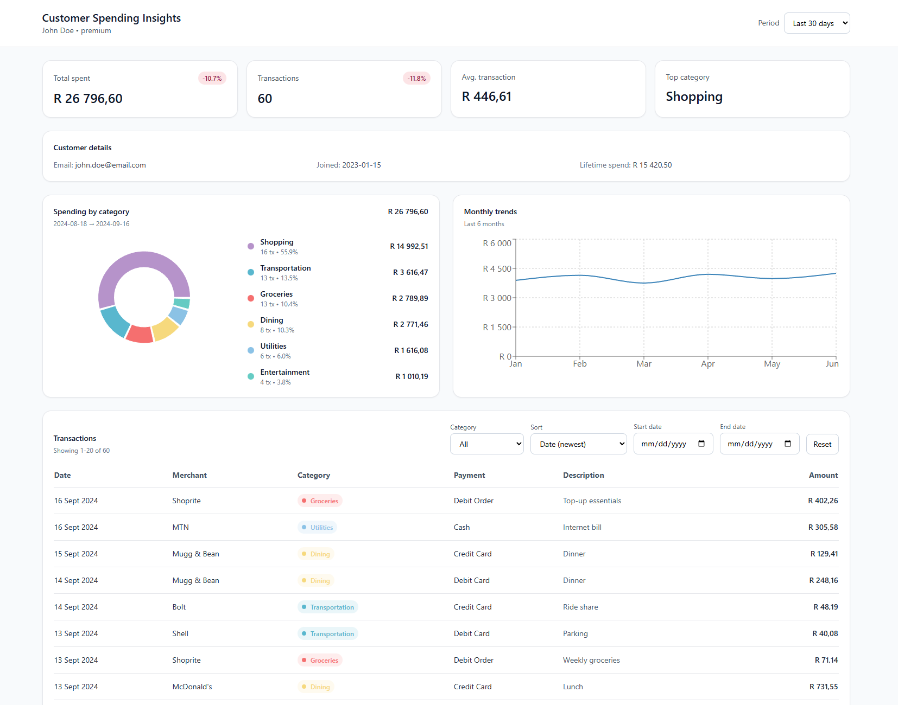

# Customer Spending Insights

## Overview
Customer Spending Insights is a full‑stack financial analytics platform designed to provide near‑real‑time insight into customer spending behaviour.  

---

## Dashboard



## High‑Level Architecture

The platform consists of three primary layers:

1. **Frontend (React + TypeScript)**
   - Data visualisation (charts, tables, KPIs)
   - Period and date‑range filtering
   - Category and transaction exploration

2. **Backend API (.NET 10, ASP.NET Core)**
   - Query orchestration
   - Business‑logic driven aggregation
   - Deterministic date‑range resolution
   - Data shaping and contract enforcement

3. **Container Layer (Docker Compose)**
   - NGINX‑based frontend delivery
   - Kestrel‑hosted API
   - Network‑isolated service communication

---

## Technology Stack

| Layer | Technology |
|------|-----------|
| Frontend | React, TypeScript, Vite, Tailwind, Recharts |
| API | ASP.NET Core (.NET 10), C# |
| Data | In‑memory simulated dataset |
| Networking | REST, JSON |
| Containerisation | Docker, Docker Compose |
| Reverse Proxy | NGINX |

---

## Data Flow

1. The frontend requests data from `/api/customers/{id}` endpoints.
2. The API resolves the requested date range using `DateRangeService`.
3. Transactions are filtered, aggregated and grouped server‑side.
4. Domain services return strongly‑typed DTOs.
5. The frontend renders KPIs, charts and tables from the API response.

This guarantees:
- A single source of truth for time windows
- No duplicated aggregation logic in the UI
- Predictable analytics results

---

## Running the System

### Prerequisites
- Docker Desktop
- Git

### Start the full stack

```bash
docker compose up --build
```

This will start:
- API on `http://localhost:8080`
- Web UI on `http://localhost:5173`

---

## Local Development (Optional)

### Backend
```bash
cd apps/api
dotnet run
```

### Frontend
```bash
cd apps/web
npm install
npm run dev
```

## Troubleshooting
### 1) Ports already in use (8080 / 5173)
**Symptoms**
- `bind: address already in use`
- Containers exit immediately after startup
- You can’t open `http://localhost:8080` or `http://localhost:5173`

**Fix**
- Stop the process using the port, or change the host-side port mapping in `docker-compose.yml`.
- Quick checks:
  - **Windows (PowerShell):**
    ```bash
    netstat -ano | findstr :8080
    netstat -ano | findstr :5173
    ```
  - **macOS/Linux:**
    ```bash
    lsof -i :8080
    lsof -i :5173
    ```

---

### 2) `docker-compose` not found (Compose v1 vs v2)
**Symptoms**
- `docker-compose: command not found`

**Fix**
- Use Docker Compose v2:
  ```bash
  docker compose version
  ```
- If unavailable, update Docker Desktop.

---

### 3) Web UI shows, but API calls fail (proxy / `/api` path mismatch)
Your NGINX config proxies **`/api/`** to the API container:

- Browser requests `http://localhost:5173/api/...`
- NGINX forwards to `http://api:8080/api/...`

**Symptoms**
- UI loads but charts/KPIs fail
- Browser console shows `404` or `Failed to fetch` on `/api/...`

**Fix**
- Ensure the API routes actually exist under `/api/...`.

If your ASP.NET routes are **NOT** prefixed with `/api` (e.g. they are `/customers/...`), then you must either:

**Option A (recommended): Strip `/api` in NGINX** by adding a trailing slash to `proxy_pass`:
```nginx
location /api/ {
  proxy_pass http://api:8080/;
}
```
This maps:
- `/api/customers/...` -> `http://api:8080/customers/...`

**Option B: Keep NGINX as-is** and ensure your API endpoints are actually mounted at `/api/...`.

---

### 4) Swagger works on `:8080` but not on `:5173/swagger/`
Your NGINX config exposes Swagger through the Web container:
- `http://localhost:5173/swagger/` -> `http://api:8080/swagger/`

**Symptoms**
- `http://localhost:8080/swagger` works
- `http://localhost:5173/swagger/` fails or returns a broken page

**Fix**
- Use the exact trailing-slash route:
  - ✅ `http://localhost:5173/swagger/`
- If the Swagger UI loads but “Try it out” calls fail, the API may need forwarded headers configuration when behind a reverse proxy.

---

### 5) CORS errors when running frontend and backend separately
**Symptoms**
- “blocked by CORS policy” in the browser
- Requests from `http://localhost:5173` to `http://localhost:8080` fail

**Fix**
- Preferred: keep frontend requests on **same origin** (`/api/...`) by using an equivalent Vite proxy in local dev.
- Alternative: enable CORS in the API for `http://localhost:5173` (development only).

---

### 6) NGINX default welcome page shown instead of the app
**Symptoms**
- Opening `http://localhost:5173` shows the default “Welcome to nginx!” page

**Fix**
- This usually means the built SPA files were not copied into `/usr/share/nginx/html`.
- Verify your frontend Dockerfile:
  - Builds the SPA
  - Copies build output into `/usr/share/nginx/html`
  - Copies your NGINX config into `/etc/nginx/conf.d/default.conf`
- Then rebuild without cache:
  ```bash
  docker compose build --no-cache
  docker compose up
  ```

---

### 7) Changes not reflected after edits (stale builds / cache)
**Symptoms**
- You changed code but behaviour doesn’t change

**Fix**
- Rebuild:
  ```bash
  docker compose up --build
  ```
- Still stale? Force no-cache and reset volumes:
  ```bash
  docker compose down -v
  docker compose build --no-cache
  docker compose up
  ```

---

### 8) API container is up, but NGINX returns 502 Bad Gateway
**Symptoms**
- `/api/...` returns `502`
- NGINX logs show upstream connection errors

**Fix**
- Confirm the API listens on **port 8080 inside the container** (must match `proxy_pass http://api:8080`).
- Check logs:
  ```bash
  docker compose logs api
  docker compose logs web
  ```
---

## Testing

### API Tests
```bash
cd apps/api
dotnet test
```

### Frontend Type Safety
```bash
cd apps/web
npm run build
```

---

## API Overview

| Endpoint | Description |
|--------|-------------|
| `/customers/{id}/profile` | Customer metadata |
| `/customers/{id}/spending/summary` | KPIs |
| `/customers/{id}/spending/categories` | Category breakdown |
| `/customers/{id}/spending/trends` | Monthly trends |
| `/customers/{id}/transactions` | Transaction listing |

All endpoints share a unified date‑range model.

---

## Date Range Engine

The backend supports:
- `7d`, `30d`, `90d`, `1y`
- Custom `startDate` / `endDate`

Rules:
- Custom ranges override periods
- Missing endDate defaults to today
- Missing startDate defaults to 30‑day lookback
- Validation guarantees `startDate ≤ endDate`

This prevents UI‑driven data corruption.

---

## Security & Stability Considerations

- Backend performs all filtering and aggregation
- UI never computes financial totals
- All queries validated server‑side
- Strict typing on all API contracts

---
